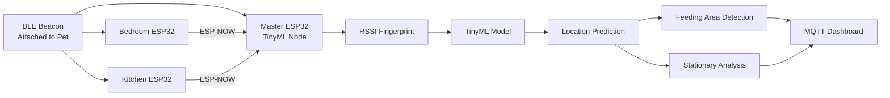

# TinyML-Enabled Indoor Pet Tracking and Behavior Monitoring

An edge-based indoor pet tracking system that combines BLE RSSI fingerprinting, TinyML, and ESP32 devices to perform room-level localization and behavior monitoring without cloud dependency.

# How it works

This is an overview of the proposed indoor pet tracking and behavior monitoring system. The system works as follows:

+ The pet wears a BLE beacon that continuously broadcasts Bluetooth signals.

+ Three ESP32 receivers positioned in different rooms measure the signal strength (RSSI) and forward their observations to a master ESP32 node. 

+ The master node combines these measurements into an RSSI fingerprint and runs a TinyML localization model directly on the device.

+ The predicted location is then used to monitor feeding-area visits and detect prolonged stationary behavior, enabling real-time indoor pet tracking without relying on cloud infrastructure.

## Features

- BLE RSSI fingerprinting localization
- ESP-NOW communication between ESP32 nodes
- TinyML inference on ESP32
- Feeding area detection
- Stationary behavior analysis
- Real-time MQTT dashboard updates
- Cloud-independent architecture
  
# System Architecture

The system consists of:

- 1 BLE beacon attached to the pet
- 3 ESP32 receiver nodes
- 1 ESP32 master node
- TinyML localization model
- MQTT dashboard

# Hardware Setup

- **Pet to track.** Any pet wearing a BLE beacon.
- **Custom BLE beacon.** We used custom-designed BLE beacon attached to the pet's collar for RSSI broadcasting (Any BLE transmitters can also be used). ~ 0 TL
- **ESP32 nodes.** Three ESP32 boards deployed across the home for RSSI collection and TinyML inference. ~ 600 TL total
- **Wi-Fi connectivity.** Used for MQTT dashboard communication.

# Software Setup

### ESP32 Nodes

The ESP32 firmware is responsible for BLE scanning, RSSI collection, ESP-NOW communication, and TinyML inference. 
Receiver nodes forward RSSI measurements to the master node, while the master node performs RSSI fingerprint generation and on-device localization.

A simplified BLE scanner example is available in:

`firmware/examples/ble_scanner/`

### MQTT Dashboard

Prediction results are published through MQTT and displayed on a real-time dashboard, allowing continuous monitoring of room-level location, feeding area visits, and stationary behavior.

# Dataset Collection

RSSI fingerprints were collected from:

- Living Room
- Bedroom
- Kitchen
- Feeding Area

Both stationary and dynamic movement sessions were recorded.

- tablo eklenecek.

# Training and Testin Machine Learning Models

After data collection, RSSI measurements from all ESP32 nodes were merged into a fingerprint dataset and labeled according to the pet's location.

Several machine learning algorithms were evaluated during experimentation, including:

- K-Nearest Neighbors (KNN)
- Decision Tree (DT)
- Random Forest (RF)
- Support Vector Machine (SVM)
- Multi-Layer Perceptron (MLP)

The MLP model was selected for deployment due to its strong generalization performance and compatibility with TinyML deployment on ESP32 devices.

