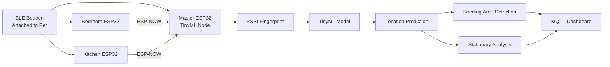

# TinyML-Enabled Indoor Pet Tracking and Behavior Monitoring

An edge-based indoor pet tracking system that combines BLE RSSI fingerprinting, TinyML, and ESP32 devices to perform room-level localization and behavior monitoring without cloud dependency.


# How it works

This is an overview of the proposed indoor pet tracking and behavior monitoring system. The system works as follows:


+ The pet wears a BLE beacon that continuously broadcasts Bluetooth signals.

+ Three ESP32 receivers positioned in different rooms measure the signal strength (RSSI) and forward their observations to a master ESP32 node. 

+ The master node combines these measurements into an RSSI fingerprint and runs a TinyML localization model directly on the device.

+ The predicted location is then used to monitor feeding-area visits and detect prolonged stationary behavior, enabling real-time indoor pet tracking without relying on cloud infrastructure.

## Features

- BLE RSSI fingerprinting localization
- ESP-NOW communication between ESP32 nodes
- TinyML inference on ESP32
- Feeding area detection
- Stationary behavior analysis
- Real-time MQTT dashboard updates
- Cloud-independent architecture
  
# System Architecture


The system consists of:

- 1 BLE beacon attached to the pet
- 3 ESP32 receiver nodes
- 1 ESP32 master node
- TinyML localization model
- MQTT dashboard

# Hardware Setup

- **Pet to track.** Any pet wearing a BLE beacon.
- **Custom BLE beacon.** We used custom-designed BLE beacon attached to the pet's collar for RSSI broadcasting (Any BLE transmitters can also be used). ~ 0 TL
- **ESP32 nodes.** Three ESP32 boards deployed across the home for RSSI collection and TinyML inference. ~ 600 TL total
- **Wi-Fi connectivity.** Used for MQTT dashboard communication.

# Software Setup

### ESP32 Nodes

The ESP32 firmware is responsible for BLE scanning, RSSI collection, ESP-NOW communication, and TinyML inference. 
Receiver nodes forward RSSI measurements to the master node, while the master node performs RSSI fingerprint generation and on-device localization.

We provided the C/C++ source code in Arduino IDE, which is available at:

`firmware/examples/ble_scanner/`

### MQTT Dashboard

Prediction results are published through MQTT and displayed on a real-time dashboard, allowing continuous monitoring of room-level location, feeding area visits, and stationary behavior.

# Dataset Collection

RSSI fingerprints were collected from:

- Living Room
- Bedroom
- Kitchen
- Feeding Area

Both stationary and dynamic movement sessions were recorded.

### Raw Session Sample

Example of RSSI measurements collected directly from ESP32 receiver nodes before preprocessing.

| timestamp_ms | rssi_living | rssi_kitchen | rssi_bedroom | label | session | note |
|-------------|------------|-------------|-------------|--------|---------|------|
| 2940 | -82 | -110 | -110 | living_room | S01 | sofa_near |
| 5154 | -79 | -91 | -110 | living_room | S01 | sofa_near |
| 7369 | -73 | -91 | -110 | living_room | S01 | sofa_near |
| 9583 | -73 | -110 | -110 | living_room | S01 | sofa_near |
| 11797 | -73 | -99 | -110 | living_room | S01 | sofa_near |

### Preprocessed Dataset Sample

After cleaning, label encoding, and feature scaling, the dataset is transformed into the format used for machine learning training.

| rssi_living | rssi_kitchen | rssi_bedroom | label |
|------------|-------------|-------------|-------|
| -0.127 | 1.582 | -0.680 | 1 |
| 0.379 | -1.012 | -0.680 | 0 |
| -0.541 | 1.730 | -0.680 | 1 |
| 0.563 | 0.915 | -0.680 | 0 |
| 0.701 | 0.100 | -0.680 | 0 |

The raw RSSI measurements are first collected from multiple ESP32 receivers and labeled according to the pet's actual location.
After preprocessing, RSSI features are scaled and labels are encoded, producing the final fingerprint dataset used for training and evaluating the localization models.


# Training and Testing Machine Learning Models

After data collection, RSSI measurements from all ESP32 nodes were merged into a fingerprint dataset and labeled according to the pet's location.

Several machine learning algorithms were evaluated during experimentation, including:

- K-Nearest Neighbors (KNN)
- Decision Tree (DT)
- Random Forest (RF)
- Support Vector Machine (SVM)
- Multi-Layer Perceptron (MLP)


The MLP model was selected for deployment due to its strong generalization performance and compatibility with TinyML deployment on ESP32 devices.

### Selected Model Performance

The confusion matrix below summarizes the performance of the selected MLP model on the final evaluation dataset.


The confusion matrix shows that most samples were classified correctly across all indoor locations.
The kitchen class achieved perfect recall, while the living room and feeding area classes also demonstrated strong classification performance.
Most misclassifications occurred between the bedroom and kitchen classes, which is expected due to similar RSSI patterns observed in neighboring indoor areas.

### Classification Metrics


The selected MLP model achieved consistently high precision, recall, and F1-scores across all classes.
The feeding area class obtained perfect precision, while the living room class achieved the highest overall balanced performance.
These results indicate that BLE RSSI fingerprinting combined with TinyML can provide reliable room-level localization in real indoor environments.

# Deploying TinyML on ESP32

The final localization model was trained using Scikit-Learn and then converted into a format suitable for deployment on ESP32 devices.

We followed the deployment process according to the TinyML pipeline shown below:

```text
RSSI Dataset
      │
      ▼
Train MLP Model
      │
      ▼
TensorFlow Model
      │
      ▼
TensorFlow Lite (.tflite)
      │
      ▼
model_data.h
      │
      ▼
ESP32 Deployment
      │
      ▼
Real-Time Inference
```

After deployment, the ESP32 master node performs localization inference directly on-device using TensorFlow Lite Micro, eliminating the need for cloud-based processing.

# Dashboard

The system includes a lightweight MQTT-based dashboard for monitoring localization results in real time.

The ESP32 master node publishes prediction results through MQTT, while the dashboard subscribes to these messages and updates the interface automatically.

The dashboard provides:


### Notes:
- The dashboard-enabled firmware is available in:

`Firmware/master_esp32/master_esp32_tinyml_with_dashboard.ino`

- A dashboard-free deployment version is also provided for standalone TinyML operation:

`Firmware/master_esp32/master_esp32_tinyml_deploy.ino`

# Repository Structure

```text
edge-pet-tracker
│
├── Firmware
│   │
│   ├── ble_scanner
│   │   ├── ble_scanner_bedroom_test.ino
│   │   └── espnow_rssi_master_test.ino
│   │
│   ├── master_esp32
│   │   ├── master_esp32_tinyml_deploy.ino
│   │   ├── master_esp32_tinyml_with_dashboard.ino
│   │   └── model_data.h
│   │
│   └── slave_esp32
│       ├── slave_bedroom_tinyml_deploy.ino
│       ├── slave_bedroom_tinyml_with_dashboard.ino
│       ├── slave_kitchen_tinyml_deploy.ino
│       └── slave_kitchen_tinyml_with_dashboard.ino
│
├── dashboard
│   ├── index.html
│   ├── script.js
│   ├── style.css
│   └── images/
│
├── data
│   └── processing
│       ├── collect_data.py
│       ├── create_dataset.py
│       └── preprocess_dataset.py
│
├── tinyml
│   ├── convert_sklearn_to_tf.py
│   ├── convert_tf_to_tflite.py
│   └── mlp_3_8_4_model.tflite
│
├── requirements.txt
├── LICENSE
└── README.md
```

### Folder Description

| Folder             | Description                                                                                         |
| ------------------ | --------------------------------------------------------------------------------------------------- |
| `Firmware/`        | ESP32 firmware for BLE scanning, ESP-NOW communication, TinyML inference, and dashboard integration |
| `dashboard/`       | MQTT-based web dashboard for real-time monitoring                                                   |
| `data/processing/` | Scripts for data collection, dataset creation, and preprocessing                                    |
| `tinyml/`          | TinyML model conversion pipeline and TensorFlow Lite model                                          |


# Acknowledgements

This project was inspired by the Cat Localizer project developed by Filip Sikora.

The original project demonstrates BLE-based indoor pet localization using multiple receivers and RSSI measurements. It served as an important reference during the early design phase of this work.

Building upon this idea, the proposed system introduces several extensions, including:

- TinyML-based edge inference on ESP32
- TensorFlow Lite Micro deployment
- ESP-NOW communication between nodes
- Feeding area detection
- Stationary behavior analysis
- Cloud-independent localization

Original project:

https://github.com/filipsPL/cat-localizer

# Authors

This repository contains the implementation developed for the undergraduate Capstone Project conducted in the Department of Computer Engineering at Istinye University.

**Project Team**

- Ahsen Dursun
- Süreyya Yıldırım
- Ebru Çepni

**Institution**

Department of Computer Engineering  
Istinye University  
Istanbul, Türkiye


